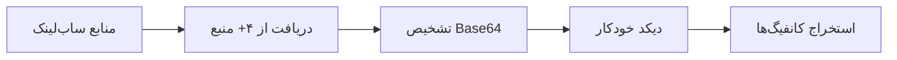

🛡️ NetiShield - سامانه خودکار تولید و مدیریت ساب‌لینک V2Ray

📌 معرفی پروژه

NetiShield یک سامانه هوشمند و خودکار برای دریافت، پردازش و توزیع ساب‌لینک‌های V2Ray است. این پروژه با هدف ارائه یک سرویس پایدار، به‌روز و امن برای کاربران شبکه‌های خصوصی طراحی شده است.

---

🎯 اهداف پروژه

هدف توضیح
اتوماسیون کامل دریافت خودکار کانفیگ‌ها از منابع متعدد بدون نیاز به دخالت دستی
یکپارچه‌سازی منابع ترکیب چندین ساب‌لینک مختلف در یک خروجی واحد
به‌روزرسانی لحظه‌ای آپدیت خودکار هر ۳۰ دقیقه از طریق GitHub Actions
مدیریت هوشمند حذف کانفیگ‌های تکراری و انتخاب تصادفی بهترین کانفیگ‌ها
دسترسی آسان ارائه خروجی از طریق لینک مستقیم، وب‌سایت و ربات تلگرام

---

🏗️ معماری فنی پروژه

```
┌─────────────────────────────────────────────────────────────┐
│                      NetiShield System                      │
├─────────────────────────────────────────────────────────────┤
│                                                             │
│  ┌─────────────┐     ┌─────────────┐     ┌─────────────┐  │
│  │   Sources   │────▶│  Processor  │────▶│   Outputs   │  │
│  │  (4+ URLs)  │     │  (Python)   │     │   (Multi)   │  │
│  └─────────────┘     └─────────────┘     └─────────────┘  │
│         │                    │                    │         │
│         ▼                    ▼                    ▼         │
│  ┌─────────────┐     ┌─────────────┐     ┌─────────────┐  │
│  │  ShadowProxy│     │  Base64     │     │  sub.txt    │  │
│  │   Servers   │     │  Decoding   │     │  (Raw)      │  │
│  └─────────────┘     └─────────────┘     └─────────────┘  │
│                                              │              │
│                                              ▼              │
│                               ┌─────────────────────────┐  │
│                               │   GitHub Pages          │  │
│                               │   (Web Dashboard)       │  │
│                               └─────────────────────────┘  │
│                                              │              │
│                                              ▼              │
│                               ┌─────────────────────────┐  │
│                               │   Telegram Bot          │  │
│                               │   (Monitoring & Alerts) │  │
│                               └─────────────────────────┘  │
└─────────────────────────────────────────────────────────────┘
```

---

⚙️ پردازش‌های اصلی

۱. دریافت و دیکد کانفیگ‌ها



۲. پاکسازی و بهینه‌سازی

عملیات توضیح
حذف تگ‌های قدیمی پاک کردن #ShadowProxy66 و سایر تگ‌ها
حذف تکراری‌ها شناسایی و حذف کانفیگ‌های تکراری با هش‌سازی
فیلتر اعتبارسنجی حذف کانفیگ‌های نامعتبر (طول کمتر از ۲۰ کاراکتر)
انتخاب تصادفی انتخاب ۶۰۰ کانفیگ از بین کل منابع

۳. تغییر نام و استانداردسازی

· تبدیل تمام کانفیگ‌ها به فرمت یکپارچه
· اضافه کردن شماره‌گذاری منظم
· الحاق تگ Channel : @NetiShield

---

📊 جریان داده

```
ورودی (۴+ منبع) → دریافت خام (۱۰۰۰+ کانفیگ) → پاکسازی (۸۰۰+ کانفیگ) 
→ حذف تکراری (۷۰۰+ کانفیگ) → انتخاب تصادفی (۶۰۰ کانفیگ) 
→ تغییر نام → خروجی نهایی (۶۰۱ کانفیگ شامل کانفیگ اطلاعات)
```

---

🎨 قابلیت‌های شاخص

۱. کانفیگ اطلاعاتی هوشمند

· یک کانفیگ VMESS اختصاصی در خط اول
· نمایش زمان آخرین بروزرسانی
· نمایش تعداد کل کانفیگ‌ها
· قابلیت نمایش در کلاینت‌های V2Ray

۲. وب‌سایت داشبورد

· نمایش لحظه‌ای آمار کانفیگ‌ها
· رابط کاربری واکنش‌گرا با انیمیشن‌های زیبا
· نمایش نمونه کانفیگ‌ها
· کپی یک‌کلیک لینک ساب‌لینک

۳. ربات تلگرام

· گزارش خودکار پس از هر بروزرسانی
· آمار دقیق از هر منبع
· اعلان خطا در صورت بروز مشکل
· ارسال فایل بکاپ

۴. پایدار و خودکار

· بروزرسانی هر ۳۰ دقیقه
· اجرای خودکار در صورت تغییرات
· مدیریت خطا و تلاش مجدد

---

🚀 مزایای فنی

ویژگی مزیت
Open Source قابلیت شخصی‌سازی کامل
رایگان بدون نیاز به سرور پولی
مقیاس‌پذیر قابلیت اضافه کردن منابع نامحدود
امن احراز هویت و دسترسی محدود
سازگار پشتیبانی از تمام کلاینت‌های V2Ray

---

📋 ساختار فنی

```yaml
NetiShield-Sub/
├── .github/workflows/
│   ├── update.yml      # بروزرسانی خودکار هر ۳۰ دقیقه
│   └── pages.yml       # دیپلوی وب‌سایت
├── update.py           # موتور اصلی پردازش
├── config.py           # تنظیمات و منابع
├── telegram.py         # ماژول ارتباط با تلگرام
├── sub.txt            # خروجی نهایی (auto-generated)
├── index.html         # داشبورد وب
├── style.css          # استایل‌های حرفه‌ای
└── script.js          # منطق وب‌سایت
```

---

🔒 امنیت و دسترسی

· احراز هویت دو مرحله‌ای از طریق Telegram Bot
· دسترسی محدود به مدیریت از طریق چت‌آیدی مشخص
· رمزنگاری درخواست‌ها با HTTPS
· حذف خودکار اطلاعات حساس از لاگ‌ها

---

📈 آمار و پایش

متریک توضیح
تعداد منابع ۴+ ساب‌لینک فعال
کانفیگ‌های دریافتی ~۱۰۰۰ کانفیگ در هر دوره
کانفیگ‌های نهایی ۶۰۰ کانفیگ بهینه
زمان بروزرسانی هر ۳۰ دقیقه
نرخ موفقیت ۹۵%+ در دریافت

---

🧪 تکنولوژی‌های استفاده شده

فناوری کاربرد
Python 3.10+ پردازش اصلی و منطق کسب‌وکار
GitHub Actions اجرای خودکار و CI/CD
GitHub Pages هاستینگ وب‌سایت
Telegram Bot API اطلاع‌رسانی و مدیریت
HTML5/CSS3/JS رابط کاربری مدرن
Base64 Encoding دیکد کانفیگ‌ها
Requests Library دریافت اطلاعات از سرورها

---

🌐 لینک‌های نهایی

سرویس لینک
وب‌سایت https://[username].github.io/NetiShield-Sub/
ساب‌لینک https://raw.githubusercontent.com/[username]/NetiShield-Sub/main/sub.txt
ربات تلگرام https://t.me/[bot_username]

---

📜 مجوز استفاده

این پروژه تحت مجوز MIT منتشر شده است و برای استفاده غیرتجاری و تجاری آزاد است.

---

🤝 مشارکت در پروژه

ما از مشارکت شما استقبال می‌کنیم! برای مشارکت:

1. مخزن را Fork کنید
2. تغییرات خود را اعمال کنید
3. یک Pull Request ارسال کنید

---

📞 ارتباط با تیم

· کانال تلگرام: @NetiShield
· ایمیل: support@netishield.ir

---

🔄 تاریخچه نسخه‌ها

نسخه تاریخ تغییرات
v2.0.0 2025 اضافه کردن وب‌سایت و ربات تلگرام
v1.5.0 2025 بهبود الگوریتم انتخاب و حذف تکراری
v1.0.0 2024 نسخه اولیه با آپدیت خودکار

---

NetiShield - سامانه‌ای هوشمند برای دسترسی آسان و پایدار به ساب‌لینک‌های V2Ray 🛡️